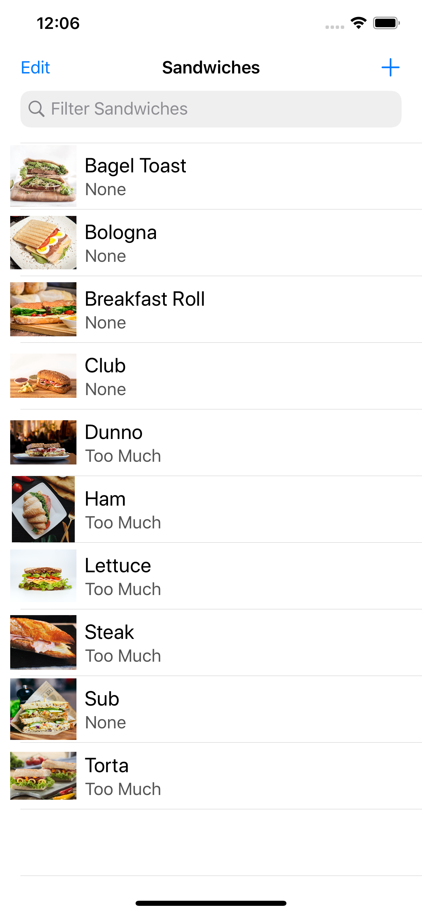
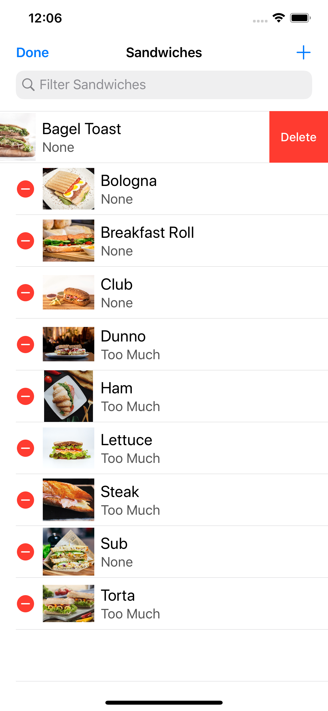
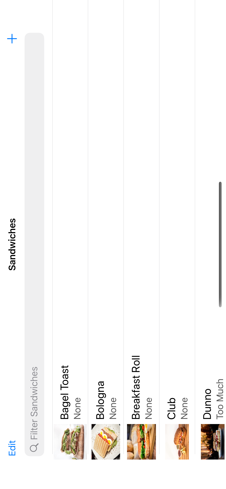

# rw_ios_bootcamp
This is an iOS bootcamp organized by raywenderlich.com

We can also use Property Lists for packaging seed data like this with an app. 

If we were shipping SandwichSaturation I would prefer JSON for seeding data for the following reasons,

1. JSON files are more commonly shared and used nowadays

2. Pretty much any modern web API we encounter nowadays will use JSON when returning data or information to us as this format is platform independent and simple to use.

2. They're smaller in memory size, easier to read, and can handle just about anything we want to store in them.

3. And Codable makes it easy and seamless to encode and decode from either format.

# SandwichSaturation - Portrait

# Sandwich List View

# Sandwich Delete View

# SandwichSaturation Landscape

# Sandwich List View

